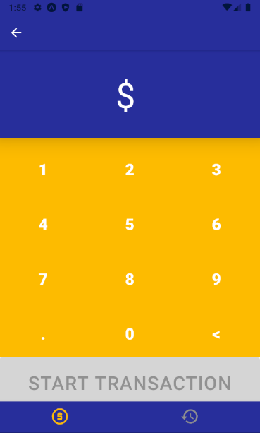

# Visa MobilePOS

## Problem Statement

Consumerism is changing as the pandemic continues to evolve. Consumers are trying to adopt contact-less solutions such as mobile wallets to avoid facing cross-contamination concerns at the moment of paying using cash or inserting/swapping their cards at POS terminals.

Despite these efforts, only 20% of United States in-store transactions are through contact-less payments. This due to the fact that most mobile wallet applications (Google Pay, Apple Pay, Samsung Pay) are focused on supporting consumers and not merchants. Thus businesses, in particular small merchants, are struggling to join the contact-less payments ecosystem.

There are companies such as Square or Clover that provide services that enable merchants to accept payments through Near Field Communication (NFC); nevertheless, these services come with overhauls. Merchants are required to get rid off their existing POS systems and purchase new hardware such as registers/peripherals from these companies. This type of disruption is a concern for many merchants, especially those already used to work with antiquated POS systems. Furthermore, these companies charge fees for each contact-less transaction processed using their peripherals (2.6\$ of the transaction amount + 10 cents, for Square). For big businesses paying these fees might not be a big problem, but for small businesses these fees can easily affect their budgets.

As we can see there are barriers blocking the entry into accepting NFC payments. There is a need for a low-cost,frictionless solution capable of enabling small merchants join the contact-less payments ecosystem with very little.

## Our Solution: Visa MobilePOS

Visa MobilePOS is a mobile application that acts as a modern POS terminal capable of processing NFC payments. Our goal is to let small merchants easily join the contact-less payments ecosystem by simply downloading Visa MobilePOS in their smartphone of choice!

## How does it work?

Visa MobilePOS uses NFC technology to listen to tokenized card data sent from any mobile wallet that uses Visa Token Services to generate tokens, such as Google Pay. Furthermore, Visa Direct APIs are used to process the transactions in a fast yet secure manner.

Something important to note is that Visa MobilePOS does not interact with customer's card information at all. The tokenized card data received is never decrypted by on our end. The tokenized data is sent to Visa Direct where it is securely decrypted and used to move funds from the customer's bank account.

The flow a merchant would follow to process a transaction is described in the following steps:

1. Merchant enters the transaction amount and presses the start transaction button
2. App waits for customer to send tokenized card data from his/her mobile wallet
3. Once the app receives tokenized card data, it proceeds to submit the transaction
4. Merchant is redirected to a new screen that shows the status of the transaction and the amount that was processed
5. Merchant can review a history of transactions processed using the app

_Step 1 -2_

_Step 1 -2_

_Step 1 -2_

_Step 3_

_Step 4_

_Step 5_

A complete flow of the transaction process performed by the app is illustrated in the following diagram:

## Technology Stack

- Front-end:

  - React-native
  - Material-UI
  - Figma mock-ups

- Back-end:

  - Spring Boot
  - Java
  - Heroku

- Visa Direct APIs used:

  - Pull Funds Transactions
  - Transaction Report Data

## Conclusion

COVID-19 has forced many businesses into adopting contact-less payment methods. However, integrating such processes can be difficult and costly especially for small merchants. Visa Mobile POS will help small merchants join the contact-less payment ecosystem in a fast yet reliable manner.
